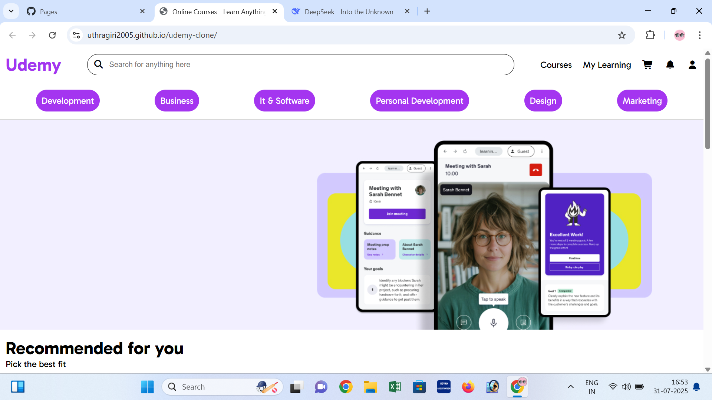

# udemy-clone

A simple Udemy-inspired course platform built with HTML and basic CSS. This project showcases course listings with ratings, instructors, and prices in a clean, responsive layout.

## Features

- Course cards with title, instructor, rating, and price
- Organized sections for recommended and popular courses
- Category navigation sidebar
- Responsive design (works on mobile and desktop)

## Screenshots

.png)
.png)
.png)

## Technologies Used

- HTML5
- CSS3 (no frameworks)

